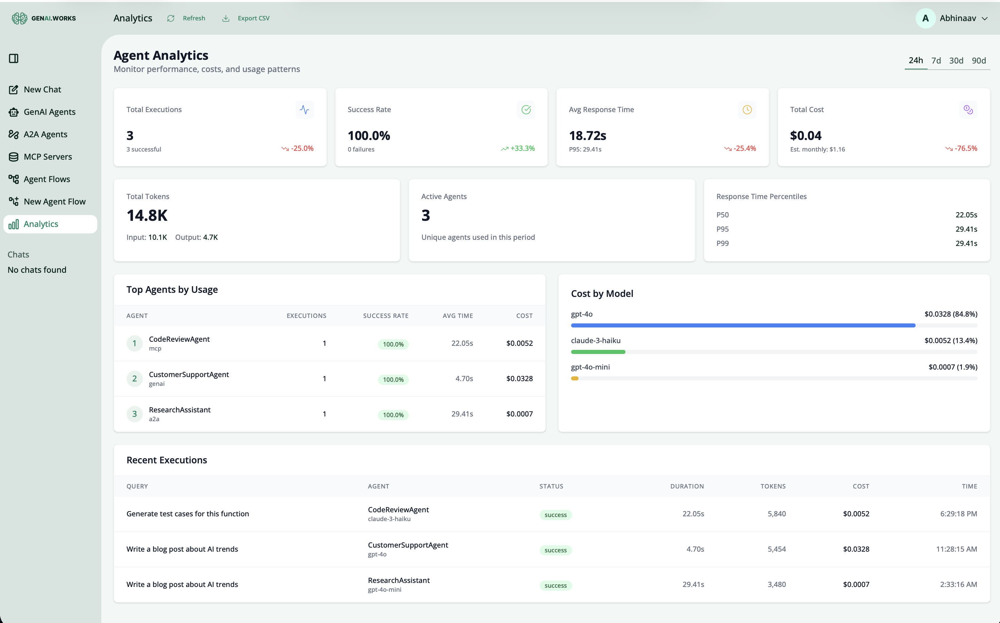
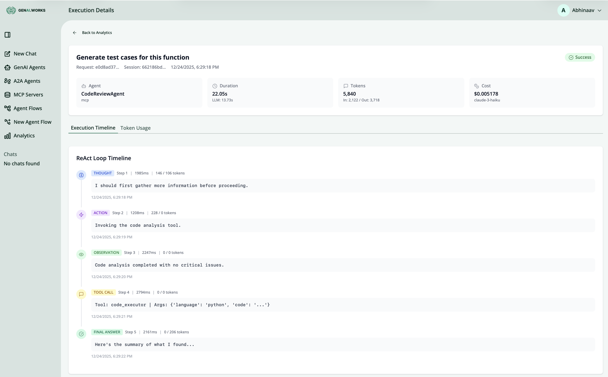
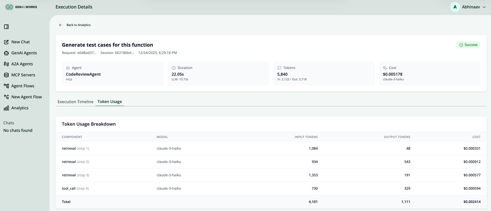

# Agent Analytics & Observability

This document describes the Analytics and Observability features for GenAI AgentOS, providing comprehensive monitoring of agent executions, cost tracking, and performance insights.

## Overview

The Analytics module provides:
- **Real-time execution monitoring** - Track all agent invocations
- **Performance analytics** - Response times, success rates, throughput
- **Cost tracking** - Token usage and cost breakdown by model/agent
- **Query inspection** - Detailed ReAct loop visualization
- **Budget management** - Set spending thresholds and alerts

## Screenshots

### Analytics Dashboard


The main dashboard displays:
- **Total Executions** - Number of agent invocations in the selected period
- **Success Rate** - Percentage of successful executions
- **Avg Response Time** - Mean execution time with P95 percentile
- **Total Cost** - Cumulative cost with monthly projection
- **Total Tokens** - Input/output token breakdown
- **Active Agents** - Unique agents used in the period
- **Response Time Percentiles** - P50, P95, P99 latency metrics

### Top Agents & Cost Breakdown


- **Top Agents by Usage** - Table showing most-used agents with execution counts, success rates, average times, and costs
- **Cost by Model** - Visual breakdown of spending across different LLM models (GPT-4o, Claude, Gemini, etc.)

### Recent Executions


- **Recent Executions Table** - List of recent agent invocations with:
  - Query preview
  - Agent name
  - Status (success/failure/timeout)
  - Duration
  - Token count
  - Cost
  - Timestamp
- Click any execution to view detailed ReAct loop traces

## Accessing Analytics

Navigate to **Analytics** in the sidebar or visit `/analytics` directly.

### Time Period Selection
Use the period selector (24h, 7d, 30d, 90d) in the top-right to adjust the analytics window.

### Export Data
Click **Export CSV** to download analytics data for external analysis.

---

## Integration Guide for Developers

### Automatic Logging

Agent executions are **automatically logged** when using the GenAI Agent framework. No additional code is required for basic tracking.

### Adding Execution Tracking to Custom Agents

If you're building custom agents outside the standard framework, you need to record executions using the analytics service.

#### Python Example

```python
from datetime import datetime
from uuid import uuid4
from src.repositories.analytics import AgentExecutionRepository
from src.schemas.api.analytics.schemas import AgentExecutionCreate

async def track_agent_execution(
    db_session,
    user_id: str,
    agent_name: str,
    agent_type: str,
    model_name: str,
    input_tokens: int,
    output_tokens: int,
    execution_time_ms: int,
    status: str = "success",
    error_message: str = None,
    query_preview: str = None,
):
    """Record an agent execution for analytics."""

    repo = AgentExecutionRepository(db_session)

    execution = AgentExecutionCreate(
        request_id=uuid4(),
        session_id=uuid4(),
        agent_name=agent_name,
        agent_type=agent_type,
        model_name=model_name,
        status=status,
        input_tokens=input_tokens,
        output_tokens=output_tokens,
        total_tokens=input_tokens + output_tokens,
        execution_time_ms=execution_time_ms,
        cost_usd=calculate_cost(model_name, input_tokens, output_tokens),
        query_preview=query_preview[:100] if query_preview else None,
        error_message=error_message,
    )

    return await repo.create(execution, user_id=user_id)
```

#### Recording Execution Traces (ReAct Loop)

To enable detailed step-by-step visualization:

```python
from src.repositories.analytics import ExecutionTraceRepository
from src.schemas.api.analytics.schemas import ExecutionTraceCreate

async def record_trace_step(
    db_session,
    execution_id: str,
    step_number: int,
    step_type: str,  # "thought", "action", "observation", "tool_call", "final_answer"
    content: str,
    duration_ms: int,
    input_tokens: int = 0,
    output_tokens: int = 0,
):
    """Record a single step in the ReAct loop."""

    repo = ExecutionTraceRepository(db_session)

    trace = ExecutionTraceCreate(
        execution_id=execution_id,
        step_number=step_number,
        step_type=step_type,
        content=content,
        duration_ms=duration_ms,
        input_tokens=input_tokens,
        output_tokens=output_tokens,
    )

    return await repo.create(trace)
```

#### Recording Token Usage

For detailed cost attribution:

```python
from src.repositories.analytics import TokenUsageRepository
from src.schemas.api.analytics.schemas import TokenUsageCreate

async def record_token_usage(
    db_session,
    execution_id: str,
    component: str,  # "main_agent", "sub_agent", "tool_call", etc.
    model: str,
    input_tokens: int,
    output_tokens: int,
    step_number: int = None,
):
    """Record token usage for a specific component."""

    repo = TokenUsageRepository(db_session)

    usage = TokenUsageCreate(
        execution_id=execution_id,
        component=component,
        model=model,
        input_tokens=input_tokens,
        output_tokens=output_tokens,
        cost_usd=calculate_cost(model, input_tokens, output_tokens),
        step_number=step_number,
    )

    return await repo.create(usage)
```

### Middleware Hook (Recommended)

For automatic tracking across all agents, add the analytics middleware:

```python
# In your agent initialization or middleware setup
from src.middleware.analytics import AnalyticsMiddleware

# Add to your FastAPI app or agent router
app.add_middleware(AnalyticsMiddleware)
```

### WebSocket Integration

For real-time agent executions via WebSocket, analytics are automatically captured in the message handler:

```python
# In src/routes/websocket.py - analytics hooks are already integrated
# When processing agent responses, execution data is automatically logged
```

---

## API Reference

### Analytics Endpoints

| Endpoint | Method | Description |
|----------|--------|-------------|
| `/api/analytics/overview` | GET | Dashboard summary statistics |
| `/api/analytics/executions` | GET | Paginated list of executions |
| `/api/analytics/executions/{id}` | GET | Detailed execution with traces |
| `/api/analytics/agents/{id}/stats` | GET | Per-agent statistics |
| `/api/analytics/costs/summary` | GET | Cost breakdown by model/agent |
| `/api/analytics/costs/forecast` | GET | Projected monthly costs |
| `/api/analytics/budgets` | GET/POST | List/create budget alerts |
| `/api/analytics/budgets/{id}` | PATCH/DELETE | Update/delete budget alert |
| `/api/analytics/comparison/models` | GET | Model performance comparison |
| `/api/analytics/export` | GET | Export data (JSON/CSV) |

### Query Parameters

#### Overview Endpoint
```
GET /api/analytics/overview?period=7d
GET /api/analytics/overview?start_date=2024-01-01&end_date=2024-01-31
```

#### Executions List
```
GET /api/analytics/executions?page=1&page_size=20
GET /api/analytics/executions?status=success
GET /api/analytics/executions?agent_id=<uuid>
GET /api/analytics/executions?sort_by=started_at&sort_order=desc
```

#### Export
```
GET /api/analytics/export?format=json
GET /api/analytics/export?format=csv&period=30d
```

---

## Budget Alerts

### Creating a Budget Alert

```bash
curl -X POST /api/analytics/budgets \
  -H "Authorization: Bearer <token>" \
  -H "Content-Type: application/json" \
  -d '{
    "threshold_usd": 100.00,
    "period_days": 30,
    "alert_type": "warning",
    "alert_at_percentage": 80,
    "email_notification": true
  }'
```

### Alert Types
- **warning** - Notification only, execution continues
- **hard_stop** - Blocks further executions when threshold reached

### Budget Scopes
- **user** - Per-user spending limit
- **agent** - Per-agent spending limit
- **flow** - Per-workflow spending limit
- **global** - Organization-wide limit

---

## Database Schema

### Core Tables

```sql
-- Agent executions
CREATE TABLE agentexecutions (
    id UUID PRIMARY KEY,
    user_id UUID REFERENCES users(id),
    request_id UUID NOT NULL,
    session_id UUID NOT NULL,
    agent_id UUID,
    agent_name VARCHAR,
    agent_type VARCHAR,
    model_name VARCHAR,
    status executionstatus NOT NULL,
    input_tokens INTEGER DEFAULT 0,
    output_tokens INTEGER DEFAULT 0,
    total_tokens INTEGER DEFAULT 0,
    cost_usd NUMERIC(10,6) DEFAULT 0,
    execution_time_ms INTEGER DEFAULT 0,
    llm_time_ms INTEGER DEFAULT 0,
    query_preview VARCHAR,
    error_type VARCHAR,
    error_message VARCHAR,
    started_at TIMESTAMP DEFAULT NOW(),
    completed_at TIMESTAMP
);

-- Execution traces (ReAct loop steps)
CREATE TABLE executiontraces (
    id UUID PRIMARY KEY,
    execution_id UUID REFERENCES agentexecutions(id) ON DELETE CASCADE,
    step_number INTEGER NOT NULL,
    step_type executiontracesteptype NOT NULL,
    content VARCHAR,
    input_tokens INTEGER DEFAULT 0,
    output_tokens INTEGER DEFAULT 0,
    duration_ms INTEGER DEFAULT 0,
    timestamp TIMESTAMP DEFAULT NOW()
);

-- Token usage breakdown
CREATE TABLE tokenusages (
    id UUID PRIMARY KEY,
    execution_id UUID REFERENCES agentexecutions(id) ON DELETE CASCADE,
    component VARCHAR,
    model VARCHAR,
    input_tokens INTEGER NOT NULL,
    output_tokens INTEGER NOT NULL,
    cost_usd NUMERIC(10,6) NOT NULL,
    step_number INTEGER
);

-- Budget alerts
CREATE TABLE budgetalerts (
    id UUID PRIMARY KEY,
    user_id UUID REFERENCES users(id) ON DELETE CASCADE,
    scope budgetscope NOT NULL,
    threshold_usd NUMERIC(10,2) NOT NULL,
    period_days INTEGER DEFAULT 30,
    alert_type budgetalerttype NOT NULL,
    alert_at_percentage INTEGER DEFAULT 80,
    is_active BOOLEAN DEFAULT TRUE,
    email_notification BOOLEAN DEFAULT TRUE,
    current_spend_usd NUMERIC(10,2) DEFAULT 0
);
```

---

## Seeding Test Data

For development and testing, you can populate the analytics tables with synthetic data:

```bash
# From the backend directory
python scripts/seed_analytics_data.py

# Or via Docker
docker exec genai-backend python -m scripts.seed_analytics_data
```

This creates:
- 250 sample agent executions across 90 days
- 750+ token usage records
- 1000+ execution trace steps
- 3 sample budget alerts

---

## Troubleshooting

### No Data Showing in Dashboard

1. **Check user association** - Analytics are user-scoped. Ensure you're logged in as the user who ran the agents.

2. **Verify data exists**:
   ```bash
   docker exec genai-postgres psql -U postgres -d postgres \
     -c "SELECT COUNT(*) FROM agentexecutions WHERE user_id = '<your-user-id>';"
   ```

3. **Check time period** - Ensure the selected period (24h, 7d, etc.) includes your execution data.

### Executions Not Being Logged

1. Ensure the agent is using the standard GenAI framework
2. Check that the database connection is working
3. Verify the analytics repository is being called in your agent code

### Cost Calculations Incorrect

Cost is calculated based on model pricing. Update pricing in:
```
backend/src/utils/model_pricing.py
```